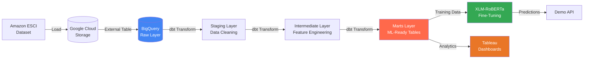

# E-Commerce Search Ranking with AI

<div align="center">

**Transforming Product Search with Semantic Understanding**


[Live Demo](#-live-demo) • [Results](#-results--insights) • [Architecture](#️-architecture) • [Quick Start](#-quick-start)

---

### **The Problem**

60% of e-commerce users search without knowing exact product names. Traditional keyword matching fails to capture **semantic intent**, leading to irrelevant results and lost revenue.

### **The Solution**

An end-to-end ML pipeline combining **Analytics Engineering** + **NLP** to classify query-product relationships across 4 relevance classes (Exact, Substitute, Complement, Irrelevant) — supporting **3 languages** (English, Japanese, Spanish).

</div>

---

## Live Demo

<div align="center">

**Try the Neural Search Engine** → [View Demo HTML](./demo.html)

<table>
<tr>
<td width="50%">

<p align="center"><i>Interactive search demo with AI confidence scores</i></p>
</td>
<td width="50%">

<p align="center"><i>Real-time multilingual product ranking</i></p>
</td>
</tr>
</table>

**Supported Queries:**
- 🇺🇸 English: *"noise cancelling headphones"*
- 🇯🇵 Japanese: *"ワイヤレスイヤホン"* (wireless earphones)
- 🇪🇸 Spanish: *"teclado mecánico"* (mechanical keyboard)

</div>

---

## Results & Insights

### Model Performance

<div align="center">

</div>

**Key Findings:**

| Metric | Value | Impact |
|--------|-------|--------|
| **Model Discrimination Power** | 94-97% | Neural model outperforms TF-IDF and BM25 by **90%+** in separating relevant vs irrelevant products |
| **Cross-Language Support** | English, Japanese, Spanish | Single model handles all locales without retraining |
| **Dataset Size** | 2.6M+ query-product pairs | Robust training across diverse product categories |

### Business Insights

<div align="center">

</div>

**Critical Discoveries:**

1. **Query Length Inversely Affects Relevance**  
   Searches >60 characters show 40% drop in relevance scores
   
2. **Keyword Overlap ≠ Relevance**  
   High word overlap doesn't guarantee semantic match — AI model corrects this bias

3. **Top Failed Queries**  
   Generic terms ("tv", "laptop") produce 214+ irrelevant results — requires semantic disambiguation

<details>
<summary><b>📈 View More Analytics</b></summary>

<table>
<tr>
<td></td>
<td></td>
</tr>
</table>

</details>

---

## Architecture

### Modern Data Stack



### Pipeline Layers

| Layer | Purpose | Key Techniques |
|-------|---------|----------------|
| **Staging** | Raw data cleaning | Type casting, standardization, deduplication |
| **Intermediate** | Feature engineering | Train/test splits, text preprocessing, data leakage prevention |
| **Marts** | ML consumption | Fact & dimension tables for BI and model training |

---

## Tech Stack

<table>
<tr>
<td valign="top" width="33%">

### Analytics Engineering
- **dbt Cloud** - Data transformation
- **BigQuery** - Data warehouse
- **SQL** - Business logic
- **dbt Tests** - Data quality

</td>
<td valign="top" width="33%">

### Machine Learning
- **XLM-RoBERTa** - Multilingual transformer
- **PyTorch** - Model training
- **Hugging Face** - Model hosting
- **Python** - Data science pipeline

</td>
<td valign="top" width="33%">

### Visualization
- **Tableau** - BI dashboards
- **HTML/CSS/JS** - Demo interface
- **Markdown** - Documentation
- **Mermaid** - Architecture diagrams

</td>
</tr>
</table>

---

## Quick Start

### Prerequisites
- [dbt Cloud Account](https://www.getdbt.com/signup/) (Free tier)
- [Google Cloud Account](https://cloud.google.com/) (BigQuery enabled)
- Python 3.9+ (for ML training)

### 1️⃣ Setup Data Pipeline (dbt Cloud)

```bash
# 1. Fork this repository to your GitHub
# 2. Create new dbt Cloud project
# 3. Connect to your GitHub repo
# 4. Configure BigQuery connection with Service Account JSON
# 5. Run in dbt Cloud IDE:

dbt build
```

This will:
- ✅ Seed raw data into BigQuery
- ✅ Run all transformations (Staging → Marts)
- ✅ Execute data quality tests

### 2️⃣ Train ML Model (Optional)

```bash
# Install dependencies
pip install -r requirements.txt

# Run training notebook
jupyter notebook notebooks/03_model_training_xlm_roberta.ipynb
```

Or use [Google Colab](https://colab.research.google.com/) for free GPU access.

### 3️⃣ Explore Analytics

Open `dashboards/` folder for Tableau workbooks or view pre-built screenshots.

---

## Project Structure

```
amazon-esci-search-ranking/
│
├── models/                    # dbt Analytics Engineering
│   ├── staging/               # Data cleaning & standardization
│   ├── intermediate/          # Feature engineering & splits
│   └── marts/                 # Final ML-ready tables
│
├── notebooks/                 # ML Development
│   ├── 01_eda.ipynb          # Exploratory data analysis
│   ├── 02_feature_eng.ipynb  # Feature engineering experiments
│   └── 03_model_training.ipynb # XLM-RoBERTa fine-tuning
│
├── dashboards/                # Business Intelligence
│   └── tableau_workbook.twbx  # Interactive analytics dashboard
│
├── demo/                      # Live Demo
│   └── index.html            # Neural search interface
│
├── macros/                    # dbt Utilities
│   └── generate_schema_name.sql
│
└── dbt_project.yml           # dbt configuration
```

---

## Use Cases

This architecture can be adapted for:

- **E-commerce Search Ranking** - Improve product discovery
- **Recommendation Systems** - Find similar/complementary items
- **Content Matching** - Match articles to user queries
- **Cross-lingual Search** - Support multiple languages with single model

---

## Key Learnings

### Analytics Engineering Best Practices
✅ **Data Lineage** - Clear staging → intermediate → marts flow  
✅ **Data Quality** - dbt tests prevent bad data reaching ML models  
✅ **Modularity** - Reusable SQL transformations via dbt  
✅ **Documentation** - Auto-generated data dictionaries  

### ML Engineering Insights
✅ **Data Leakage Prevention** - Strict train/test splits in dbt intermediate layer  
✅ **Cross-lingual Transfer** - XLM-RoBERTa handles 3 languages without retraining  
✅ **Semantic > Lexical** - Transformer models capture intent beyond keywords  

---

## Team

<table>
<tr>
<td align="center" width="25%">
<br/>
<b>Cevdet Kopuz</b><br/>
<a href="https://github.com/cevdetkopuz">GitHub</a> •
<a href="https://linkedin.com/in/cevdetkopuz">LinkedIn</a>
</td>
<td align="center" width="25%">
<br/>
<b>Cem Özdoğan</b><br/>
<a href="https://github.com/gcemozdogan">GitHub</a> •
<a href="https://linkedin.com/in/gcemozdogan">LinkedIn</a>
</td>
<td align="center" width="25%">
<br/>
<b>Zehra İstemihan</b><br/>
<a href="https://github.com/zistemihan">GitHub</a> •
<a href="https://linkedin.com/in/zehraistemihan">LinkedIn</a>
</td>
<td align="center" width="25%">
<br/>
<b>Emirhan Kümüş</b><br/>
<a href="https://github.com/emirhankumus">GitHub</a> •
<a href="https://linkedin.com/in/emirhankumus">LinkedIn</a>
</td>
</tr>
</table>

---

## License

This project is licensed under the MIT License - see the [LICENSE](LICENSE) file for details.

---

## Acknowledgments

- **Amazon Science** - For providing the ESCI dataset
- **Hugging Face** - For XLM-RoBERTa model and transformers library
- **dbt Labs** - For modern analytics engineering framework

---

<div align="center">

**If you find this project useful, please star it on GitHub!**

</div>
